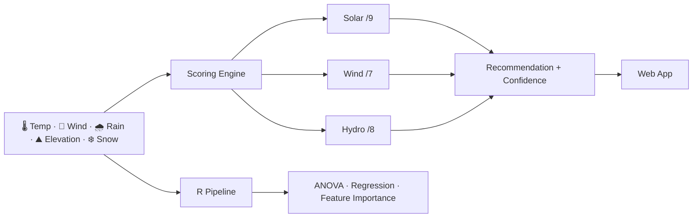
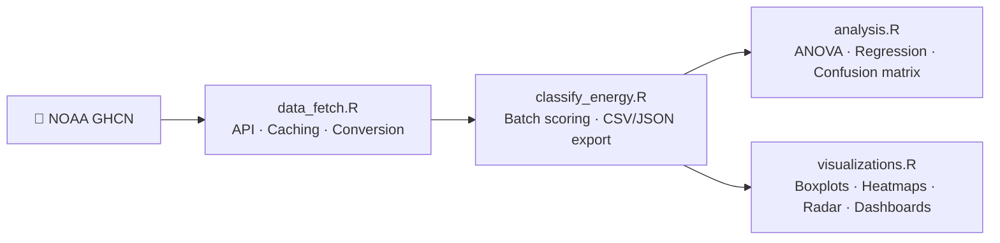

<div align="center">


# Renewable Energy Classifier

*Given the climate of a place — which renewable energy source does it actually support?*

[](https://weather-energy.netlify.app/)
[](https://github.com/Sahibjeetpalsingh/Weather-Classification)
[](https://www.ncdc.noaa.gov/data-access/land-based-station-data/land-based-datasets/global-historical-climatology-network-ghcn)
[](LICENSE)


</div>

---

The renewable energy conversation usually stops too early. People say things like *"solar is good in sunny places"* or *"wind works on coasts"* — and technically, they're right. But that level of precision doesn't help a homeowner decide whether rooftop solar is worth the investment, or a student building a regional sustainability case, or a planner comparing options across a watershed.

What they actually need is a sharper question: **given the specific climate of this exact place, which energy source does the physics actually favour — and by how much?**

That is the question this project was built to answer. Not with a model trained on labels someone else assigned. With a transparent scoring engine grounded in climate physics, validated against real NOAA station data, and wrapped in an interface anyone can open in a browser without installing anything.

---

## See It in Action

<p align="center">
  <a href="https://weather-energy.netlify.app/">
    
  </a>
</p>

Move a slider. The scores update instantly. The recommendation appears with its full reasoning — not just a label, but every condition that mattered and every point it contributed. That transparency is not a design flourish. It is the whole point.

---

## What It Looks Like

| Sliders & Presets | Score Breakdown | R Analysis Dashboard |
|:---:|:---:|:---:|
|  |  |  |

Eight built-in climate presets let you jump straight to a Desert, Monsoon, Mountain, or Coastal profile. The score breakdown panel shows the full tally — not just the winner, but why every other option lost.

---

## How It Works

The engine takes five inputs — the five climate signals that most directly determine whether solar panels, wind turbines, or hydro infrastructure will produce usable energy in a given place. It scores Solar, Wind, and Hydro independently against explicit thresholds. The highest scorer wins. The gap between first and second determines how confident the recommendation really is.



Nothing is hidden in this diagram. The same logic that runs in the browser also runs in the R batch pipeline — applied to thousands of real NOAA weather station records, validated statistically, and exported for inspection.

### The Scoring Rules

Every threshold in the table below comes from domain research in climate science and renewable energy engineering. Temperature above 15°C meaningfully extends solar production hours. Wind speed below 4 m/s means a turbine rarely reaches its operating range. Precipitation above 100 mm a month means a catchment has real water to work with. These are not arbitrary cutoffs — they are the lines where viability changes.

| | ☀️ Solar | 🌬️ Wind | 💧 Hydro |
|:---|:---|:---|:---|
| **Max score** | 9 | 7 | 8 |
| **Key triggers** | Temp > 15°C, Precip < 50mm, Snow < 10cm | Speed ≥ 4 m/s, Elev 500–2000m | Precip > 100mm, Snow > 20cm, Elev 300–2000m |
| **Penalties** | Precip > 150mm (−2) | Weak wind, flat terrain | Dry climate, no elevation |
| **Best climate** | Warm, dry, clear-sky | Exposed ridgelines, coasts | High-rainfall, mountain catchments |

### Confidence Tiers

A recommendation without a confidence measure is incomplete. Two climates can both recommend Solar — one because it scores 8/9, the other because Solar scored 5 and Wind scored 4. Those are very different situations. The margin tells you which one you're in.

| Margin (1st vs 2nd) | Confidence | What It Means |
|:---:|:---:|:---|
| ≥ 6 pts | 🟢 High | The climate strongly favours one source |
| 3–5 pts | 🟡 Moderate | Clear winner, but the runner-up is worth noting |
| 0–2 pts | 🔴 Low | The climate is genuinely split — a hybrid approach makes sense |

---

## Real Climates, Real Results

These five presets show the range of what the engine produces. Notice that the Mountain case returns *low confidence* on Wind — not because the recommendation is wrong, but because Hydro is close behind. That honesty is the point.

| Climate | Temp | Wind | Precip | Elev | Snow | Result |
|:---|:---:|:---:|:---:|:---:|:---:|:---:|
| 🏜️ Desert | 35°C | 4 m/s | 10 mm | 300 m | 0 cm | ☀️ Solar — High |
| 🏔️ Mountain | 5°C | 7 m/s | 120 mm | 2000 m | 30 cm | 🌬️ Wind — Low |
| 🌧️ Monsoon | 26°C | 5 m/s | 200 mm | 500 m | 0 cm | 💧 Hydro — High |
| 🌊 Coastal | 18°C | 8 m/s | 70 mm | 50 m | 0 cm | 🌬️ Wind — High |
| 🌿 Temperate | 12°C | 3 m/s | 90 mm | 400 m | 5 cm | 💧 Hydro — Mod |

---

## The Design Choice That Shaped Everything

Early in the project, the obvious path was to train a classifier. Collect labelled climate-energy data, pick a model, tune it, deploy it. That approach has real strengths — it can capture non-linear patterns, it handles edge cases gracefully, and it looks impressive in a portfolio.

But it also has a problem: when it tells a homeowner that Solar is their best option, they can't see why. They can't ask what would change the answer. They can't point a domain expert at the reasoning and ask whether it's sound.

For this problem — where the physics are well understood, where labelled ground-truth data is scarce, and where the *user trusting the output* matters as much as the output being correct — a rule-based system is the better tool.

| | Rule-Based | ML Classifier |
|:---|:---:|:---:|
| Logic is visible | ✅ | ❌ |
| Needs labeled training data | ❌ | ✅ |
| Users can challenge the output | ✅ | Rarely |
| Confidence is easy to communicate | ✅ | Extra work |
| Works where domain knowledge is strong | ✅ Best fit | Not ideal |

> Interpretability is not a feature here. It is the product.

---

## The R Layer: Where the Rules Get Tested

The web app makes the tool accessible. The R analysis suite makes it credible.

After building the scoring engine, the natural question is: *do these rules actually separate climates the way the physics says they should?* To answer that, the project pulls real station data from NOAA's Global Historical Climatology Network, runs the classifier in batch mode across thousands of records, and validates the results statistically.



Each module has a specific job. `data_fetch.R` handles the messy reality of working with a public API — pagination, unit conversion, retry logic, regional bounding boxes. `classify_energy.R` runs the same scoring logic from the browser, but at scale. `analysis.R` is where the rules are put under pressure.

| Module | Purpose |
|:---|:---|
| `classify_energy.R` | Batch scoring, confidence logic, export |
| `analysis.R` | ANOVA, correlation, regression, feature importance |
| `visualizations.R` | Boxplots, violins, heatmaps, scatter maps, radar charts |
| `data_fetch.R` | NOAA API pagination, caching, unit conversion |
| `utils.R` | Validation, climate zones, daylight helpers, logging |

### What the Data Said

The results validated the design. ANOVA confirmed strong separation between the climate profiles of Solar, Wind, and Hydro classes — the three groups look genuinely different in the data, not just in theory. Temperature and precipitation were the strongest separators, which matches the scoring weights. Wind speed behaved more independently, which explains why wind recommendations appear across a wider spread of climate types than Solar or Hydro.

Permutation feature importance gave a clear ordering: `Temperature > Precipitation > Wind Speed > Elevation > Snow Depth`. The engine's scoring priorities matched what the data independently ranked as most discriminating. That agreement between the rule design and the statistical validation is the result that matters most.

---

## Running the Project

**Web app** — open in any browser, nothing to install:
```
open https://weather-energy.netlify.app/
# or open index.html locally
```

**R pipeline** — run the full analysis suite:
```r
install.packages(c("jsonlite", "ggplot2", "tidyr", "dplyr", "readr", "purrr"))

source("classify_energy.R")
source("analysis.R")
source("visualizations.R")
```

**Fetch real NOAA data** — add your free CDO API token to `data_fetch.R`, then:
```r
fetch_region_data(bbox = c(lat_min, lon_min, lat_max, lon_max))
```

---

## Project Structure

```
Weather-Classification/
├── index.html             ← The web app — open and run
├── classify_energy.R      ← Core scoring engine
├── analysis.R             ← Statistical validation
├── visualizations.R       ← Charts and dashboards
├── data_fetch.R           ← NOAA API integration
├── utils.R                ← Shared helpers
├── data.csv               ← Sample dataset
└── docs/images/           ← Screenshots, GIF, hero
```

---

## What This Project Is, at Root

It is a tool for a specific gap: the space between vague climate intuition and a decision someone can actually act on. It is also a methodological argument — that in domains where the science is understood and labels are hard to come by, a transparent rule-based system earns more trust than a model that performs better on paper but can't explain itself.

The web app makes that argument accessible. The R pipeline makes it defensible. Together they demonstrate something that matters beyond this particular problem: **a model you can read is more useful than a model you can only believe.**

---

<div align="center">

**Sahibjeet Pal Singh**

[GitHub](https://github.com/Sahibjeetpalsingh) · [Live App](https://weather-energy.netlify.app/) · [LinkedIn](https://linkedin.com/in/sahibjeet-pal-singh-418824333)

</div>
