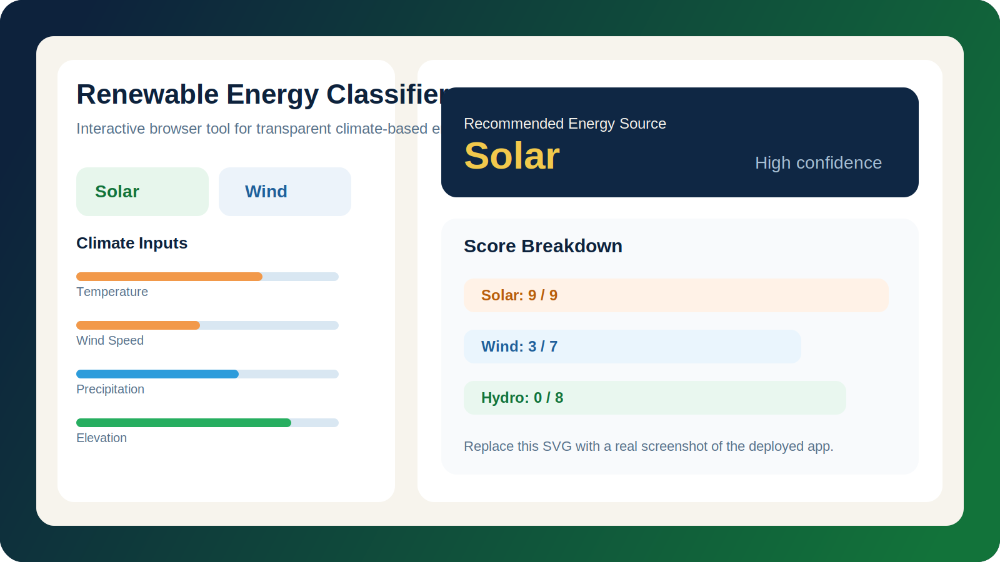
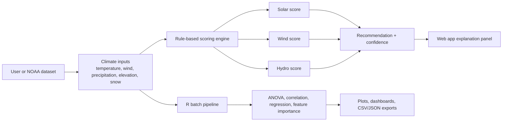

# Renewable Energy Classifier

<div align="center">

[](https://weather-energy.netlify.app/)
[](https://github.com/Sahibjeetpalsingh/Weather-Classification)
[](https://weather-energy.netlify.app/)
[](https://www.ncdc.noaa.gov/data-access/land-based-station-data/land-based-datasets/global-historical-climatology-network-ghcn)
[](LICENSE)

*Solar, Wind, or Hydro: what does the climate of a place actually support?*

</div>

<p align="center">
  <a href="https://weather-energy.netlify.app/">
    
  </a>
</p>

## The Story

The renewable energy conversation usually stops too early.

People say things like "solar is good in sunny places" or "hydro works in the mountains," but those answers are too vague to support real decisions. A homeowner deciding whether rooftop solar is worth the cost, a student building a sustainability case study, or a planner comparing options for a region needs something more precise:

**Given the climate of this exact place, which renewable energy source is most viable and why?**

That is the gap this project was built to close.

Renewable Energy Classifier is a transparent decision tool that takes five climate inputs, scores solar, wind, and hydro independently, and returns a recommendation with a visible reasoning trail. Instead of hiding the logic in a black-box model, it shows the user exactly which conditions mattered, how many points they contributed, and how confident the recommendation really is.

## Why This Project Exists

Most energy recommendation tools are either:

- too expensive for non-specialists,
- too academic to be usable quickly,
- or too opaque to trust.

This project takes a different path:

- a browser-based interface that anyone can use immediately,
- a rule-based engine grounded in climate and energy physics,
- and an R analysis suite that validates the method on real NOAA data.

The result is a tool that is accessible enough for general users and rigorous enough for research-oriented work.

## Watch It Work

<p align="center">
  <a href="https://weather-energy.netlify.app/">
    
  </a>
</p>

<p align="center">
  Open the live app above. Replace this thumbnail link with your exported demo video or walkthrough URL when ready.
</p>

## Visual Tour

The README is already wired for media. Replace the placeholder SVGs in `docs/images/` with real screenshots from the app and analysis outputs.

| Interface | Preview |
| --- | --- |
| Climate presets and slider controls |  |
| Transparent score breakdown |  |
| Analysis dashboard and charts |  |

## What The Tool Actually Does

The app evaluates a location using five climate signals:

- average temperature,
- wind speed,
- monthly precipitation,
- elevation,
- snow depth.

Each energy type is scored against explicit thresholds taken from domain research.

| Energy Type | Signals That Help | Signals That Hurt | Core Logic |
| --- | --- | --- | --- |
| Solar | Warm temperatures, low precipitation, low snow, accessible elevation | Heavy rainfall, persistent cloud cover, snow cover | Best for warm, dry, clear-sky climates |
| Wind | Strong average wind speed, favorable elevation, lower moisture exposure | Weak wind, poor terrain exposure | Best where airflow is consistently strong enough to be economically viable |
| Hydro | High precipitation, snowpack, useful elevation drop | Dry climates, flat lowland terrain | Best where water supply and gravitational head are both available |

## Why A Rule-Based Model Instead Of Machine Learning?

This was the design choice that shaped the entire project.

| Question | Rule-Based Scoring | Typical ML Classifier |
| --- | --- | --- |
| Is the logic visible? | Yes, every point is explainable | Usually no |
| Does it need a labeled training set? | No | Yes |
| Can users challenge the output? | Yes, by inspecting the exact rules | Rarely |
| Is confidence easy to communicate? | Yes, from score margins | Harder without extra work |
| Better fit for this problem? | Yes, because domain knowledge is strong and labels are scarce | Not ideal |

For this use case, interpretability is not a nice-to-have. It is the product.

## The Decision Engine

The scoring algorithm is intentionally simple enough to inspect and strong enough to justify.

| Energy Type | Maximum Score | Main Thresholds |
| --- | --- | --- |
| Solar | 9 | Temperature above 15C, additional gain above 25C, precipitation below 50 mm, snow below 10 cm, elevation below 2000 m, penalty above 150 mm precipitation |
| Wind | 7 | Wind speed at least 4 m/s, strong gain above 6 m/s, elevation between 500 m and 2000 m, precipitation below 100 mm |
| Hydro | 8 | Precipitation above 100 mm, stronger gain above 150 mm, snow above 20 cm, elevation between 300 m and 2000 m |

Confidence is derived from the gap between the top score and the runner-up:

- `6+` point margin: High confidence
- `3-5` point margin: Moderate confidence
- `0-2` point margin: Low confidence, hybrid approach worth considering

## From Browser Demo To Research Pipeline



## The Web App

The web application is built with plain HTML, CSS, and JavaScript and deployed on Netlify.

That choice was deliberate. No framework, no backend, no install step, no waiting. Open the page, move the sliders, and the recommendation updates instantly in the browser.

### Front-End Highlights

- Works as a single static page.
- Uses five sliders covering the major climate variables.
- Updates scores and recommendation in real time.
- Includes eight climate presets for quick exploration.
- Displays not just the winner, but the full scoring breakdown.
- Designed to work on desktop, tablet, and mobile.

## The R Analysis Suite

The web app is the accessible layer. The R code is the rigor layer.

| Module | Role | Highlights |
| --- | --- | --- |
| `classify_energy.R` | Core classification engine | Batch scoring, confidence logic, summaries, CSV/JSON export |
| `analysis.R` | Statistical validation | ANOVA, correlation, regression, confusion metrics, feature importance |
| `visualizations.R` | Presentation-quality charts | Boxplots, violins, heatmaps, scatter maps, radar charts, dashboards |
| `data_fetch.R` | NOAA API integration | Pagination, caching, unit conversion, retry logic, regional fetches |
| `utils.R` | Shared infrastructure | Validation, conversions, climate zones, daylight, logging, helpers |

## Example Scenarios

These presets communicate the project better than a generic feature list.

| Scenario | Inputs | Recommendation | Why It Makes Sense |
| --- | --- | --- | --- |
| Desert | `35C`, `4 m/s`, `10 mm`, `300 m`, `0 cm snow` | Solar | Hot, dry, cloud-light conditions maximize solar viability |
| Mountain | `5C`, `7 m/s`, `120 mm`, `2000 m`, `30 cm snow` | Wind, low-confidence | Strong wind and elevation favor wind, but hydro stays competitive |
| Monsoon | `26C`, `5 m/s`, `200 mm`, `500 m`, `0 cm snow` | Hydro | Heavy rainfall overwhelms solar and supports hydro viability |

## What The Analysis Found

The validation work matters because this project is not just making intuitive guesses.

- ANOVA showed strong separation between the climate profiles of Solar, Wind, and Hydro recommendations.
- Temperature and precipitation emerged as the strongest separators overall.
- Wind speed behaved more independently, which explains why wind recommendations appear across a wider mix of climates.
- Permutation feature importance ranked temperature and precipitation highest, followed by wind speed, elevation, and snow depth.
- The resulting recommendations were not just statistically distinct; they were also easy for users to interpret and defend.

That combination is the real achievement here: **the tool is both explainable and empirically grounded.**

## Why The Project Matters

This project demonstrates two things at once.

First, it is a practical tool that gives users a fast and understandable renewable energy recommendation.

Second, it makes a methodological argument: when scientific rules are well understood and labeled data is weak or unavailable, a transparent rule-based system can be more trustworthy than a more fashionable machine learning model.

## Run It

### Web App

Visit [weather-energy.netlify.app](https://weather-energy.netlify.app/) or open `index.html` locally in a browser.

### R Analysis

```r
install.packages(c("jsonlite", "ggplot2", "tidyr", "dplyr", "readr", "purrr"))

source("classify_energy.R")
source("analysis.R")
source("visualizations.R")
```

To fetch NOAA data for a region, add your NOAA CDO API token in `data_fetch.R` and call `fetch_region_data()` with a bounding box.

## Project Structure

```text
Weather-Classification/
|-- index.html
|-- classify_energy.R
|-- analysis.R
|-- visualizations.R
|-- data_fetch.R
|-- utils.R
|-- data.csv
|-- README.md
`-- docs/
    |-- images/
    `-- videos/
```

## Media Checklist

If you want the README to feel finished on GitHub, replace these placeholders with real assets:

- `docs/images/app-hero.svg` -> full app screenshot
- `docs/images/preset-gallery.svg` -> presets or slider UI screenshot
- `docs/images/score-breakdown.svg` -> recommendation results screenshot
- `docs/images/analysis-dashboard.svg` -> chart collage or dashboard export
- `docs/images/demo-thumbnail.svg` -> video poster image
- `docs/videos/` -> optional MP4 or GIF walkthrough assets

## Author

**Sahibjeet Pal Singh**

[GitHub](https://github.com/Sahibjeetpalsingh) � [Live App](https://weather-energy.netlify.app/) � [LinkedIn](https://linkedin.com/in/sahibjeet-pal-singh-418824333)
