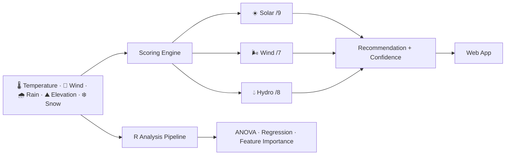
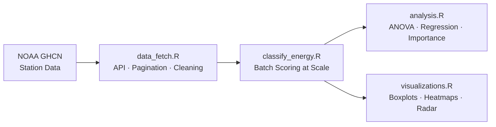

<div align="center">

# Renewable Energy Classifier

*A project that started with "just train a classifier" and ended with a scoring engine grounded in climate physics, a question about what interpretability actually costs, and a statistical validation pipeline that proved the rules held up in real data.*

[](https://weather-energy.netlify.app/)
[](https://github.com/Sahibjeetpalsingh/Weather-Classification)
[](https://www.ncdc.noaa.gov/data-access/land-based-station-data/land-based-datasets/global-historical-climatology-network-ghcn)
[](LICENSE)


</div>

<br>

## See It in Action

<p align="center">
  <a href="https://weather-energy.netlify.app/">
    
  </a>
</p>

Move a slider. Every score updates instantly. The recommendation appears with its full reasoning — not just a label, but every condition that mattered and every point it contributed. That transparency is not a design flourish. It is the whole point.

<br>

---

## The Starting Point: A Gap in the Conversation

The renewable energy conversation usually stops too early. People say things like *"solar is good in sunny places"* or *"wind works on coasts"* and technically they are right. But that level of precision does not help a homeowner decide whether rooftop solar is worth the investment, or a student building a regional sustainability case, or a planner comparing options across a watershed.

What they actually need is a sharper question: **given the specific climate of this exact place, which energy source does the physics actually favour — and by how much?**

The obvious answer was to train a machine learning classifier. Collect labelled climate-to-energy data, pick a model, tune it, deploy it. That approach has real strengths. It can capture nonlinear patterns, handle edge cases gracefully, and it looks impressive in a portfolio.

We started there. Then we hit a problem that the ML framing could not solve. And that problem is what shaped everything that came after.

<br>

---

## Chapter 1: The Design Decision That Shaped Everything

### The ML Path and Why We Left It

The natural instinct for a classification problem is to reach for a model. Random Forest, gradient boosting, a simple neural net — all of these would produce a label. *"Solar."* *"Wind."* *"Hydro."*

The problem is not the label. The problem is what happens after the label.

| Scenario | ML Classifier | Rule-Based Engine |
|:---|:---:|:---:|
| Homeowner asks: "Why Solar?" | ❌ No explanation available | ✅ Shows every scored condition |
| Domain expert asks: "Is this threshold correct?" | ❌ Cannot be interrogated | ✅ Every rule is readable |
| User asks: "What would change the answer?" | ❌ Not tractable | ✅ Move a slider and see |
| No labelled training data available | ❌ Cannot train | ✅ Physics-grounded rules need no labels |
| Confidence measure that means something | ⚠️ Extra modelling work | ✅ Built-in: margin between 1st and 2nd score |
| User trusts the output | ❌ Requires blind faith | ✅ User can audit every point |

The domain here — climate physics and renewable energy engineering — is well understood. The thresholds where solar viability meaningfully changes, where a wind turbine starts operating in its productive range, where a catchment has enough water for hydro infrastructure: these are documented, validated, and not in dispute. There was no reason to learn them from data when the data is already in the literature.

More importantly: labelled ground truth data for "which energy source is optimal for this exact climate" does not exist at scale. You cannot train a classifier on data that was never collected.

**The decision:** Build a transparent scoring engine grounded in climate physics. Not because it is simpler — it is not. Because for this problem, a system the user can challenge is more valuable than a system that performs slightly better on paper.

> Interpretability is not a feature here. It is the product.

---

### The Approach Journey

```
  Option 1               Option 2               Option 3            Final Answer
─────────────       ──────────────────      ─────────────────     ─────────────────────
 ML Classifier       Lookup Table /          Rule-Based with       Rule-Based Scoring
                     Climate Zones           Binary Thresholds     + Continuous Scoring
                                                                   + Confidence Tiers
 ❌ No labels         ❌ Too coarse            ⚠️ Cliff edges at     ✅ Graduated points
 ❌ Black box         ❌ 30 zones ≠            threshold cutoffs     ✅ Full score shown
 ❌ No confidence     real climate nuance     ❌ Tied scores = ?     ✅ Margin = confidence
─────────────       ──────────────────      ─────────────────     ─────────────────────
```

The binary threshold version was particularly instructive. Setting "Solar if Temp > 15°C" as a hard cutoff meant a climate at 14.9°C and one at 25°C got the same non-Solar verdict. That is not how physics works. Temperature is a continuous contributor to solar viability, not a gate. Moving to a **graduated points system** — where each condition contributes a weighted score rather than a pass/fail — fixed the cliff edge problem and made the scores comparable across energy types.

<br>

---

## Chapter 2: How the Scoring Engine Works

### The Five Inputs

The engine takes exactly five climate signals — the five variables that most directly determine whether solar panels, wind turbines, or hydro infrastructure will produce usable energy in a given place.

| Input | Unit | Why this one | What it controls |
|:---|:---:|:---|:---|
| **Temperature** | °C | Solar panel output and operating hours scale directly with ambient temp | Solar score most of all |
| **Wind Speed** | m/s | Turbine power output scales as the cube of wind speed — tiny changes matter enormously | Wind score almost entirely |
| **Precipitation** | mm/month | Catchment flow for hydro; cloud cover proxy for solar | Both Hydro and Solar |
| **Elevation** | m | Wind exposure, hydro head pressure, solar irradiance at altitude | All three, differently |
| **Snow Depth** | cm | Snowmelt runoff for hydro; panel coverage penalty for solar | Hydro and Solar |

Each of these was chosen because it has a direct physical mechanism — not because it was available in a dataset. The question was always: *what does the physics say this variable actually does to energy output?*

---

### The Scoring Rules

Every threshold comes from domain research in climate science and renewable energy engineering. These are not arbitrary cutoffs. They are the lines where viability actually changes.



#### ☀️ Solar — Max 9 points

| Condition | Points | Physical reason |
|:---|:---:|:---|
| Temperature > 15°C | +3 | Extends productive daylight hours and panel efficiency |
| Temperature > 25°C | +2 | Additional bonus — high heat extends output window further |
| Precipitation < 50mm | +2 | Low rain correlates strongly with clear-sky days |
| Snow Depth < 10cm | +2 | Panels remain exposed and productive |
| Precipitation > 150mm | −3 | Heavy rain means persistent cloud cover — significant penalty |

#### 🌬️ Wind — Max 7 points

| Condition | Points | Physical reason |
|:---|:---:|:---|
| Wind Speed ≥ 4 m/s | +3 | Minimum operating threshold for most commercial turbines |
| Wind Speed ≥ 7 m/s | +2 | Approaches rated power output range — disproportionate energy gain |
| Elevation 500–2000m | +2 | Exposed terrain with less surface friction = sustained wind |
| Flat terrain / low elevation | −2 | Ground friction reduces wind speed and consistency |

#### 💧 Hydro — Max 8 points

| Condition | Points | Physical reason |
|:---|:---:|:---|
| Precipitation > 100mm | +3 | Catchment has real water volume to work with |
| Precipitation > 200mm | +2 | Additional runoff volume — strong hydro signal |
| Snow Depth > 20cm | +2 | Snowmelt creates sustained seasonal flow |
| Elevation 300–2000m | +1 | Head pressure enables power generation from flow |

---

### The Confidence System

A recommendation without a confidence measure is incomplete. Two climates can both recommend Solar — one because it scores 8/9, another because Solar scored 5 and Wind scored 4. Those are very different situations. The margin tells you which one you are in.

| Gap between 1st and 2nd score | Confidence | What it means in practice |
|:---:|:---:|:---|
| 6+ points | 🟢 **High** | Climate strongly and unambiguously favours one source — act on it |
| 3–5 points | 🟡 **Moderate** | Clear winner but runner-up is worth noting in planning |
| 0–2 points | 🔴 **Low** | Climate is genuinely split — a hybrid approach makes practical sense |

This was one of the more considered design decisions in the project. Most classifiers return a single label. Adding the margin between first and second place turned a label into a recommendation with honest uncertainty attached. That distinction matters when the person using the output is making a real decision.

<br>

---

## Chapter 3: What It Looks Like

The interface has three distinct views, each serving a different part of the experience.

---

### 01 &nbsp; Climate Controls

> Set any climate profile using five sliders or jump straight in with one of eight built-in presets — Desert, Monsoon, Mountain, Coastal, and more. No configuration. No install. Open the page and the tool is ready.

<p align="center">
  <a href="https://weather-energy.netlify.app/">
    
  </a>
</p>

The eight presets were not chosen arbitrarily. They represent the major Köppen climate categories that also correspond to distinctly different renewable energy profiles — Desert (high solar), Coastal (high wind), Mountain (wind/hydro boundary), Monsoon (strong hydro), Arctic (low everything), Tropical (hydro), Plains (wind), Mediterranean (solar). Each preset demonstrates a different region of the scoring space, making the tool immediately useful without requiring the user to understand what values to enter.

---

### 02 &nbsp; Score Breakdown

> Every score is shown, not just the winner. You can see exactly why Solar lost to Hydro or why Wind barely edged out the competition. The margin between first and second is always visible, so you always know how much to trust the recommendation.

<p align="center">
  <a href="https://weather-energy.netlify.app/">
    
  </a>
</p>

This panel was the design choice that most directly expressed the project's argument. Showing only the winner is easy. Showing all three scores with their point breakdowns — which conditions contributed, which penalised, what the margin is — is what makes the output auditable rather than authoritative. A user who disagrees with a recommendation can see exactly which threshold to challenge.

---

### 03 &nbsp; R Analysis Dashboard

> The R pipeline produces real statistical charts from NOAA station data. Boxplots, heatmaps, radar charts and correlation plots — proving that the scoring rules hold up in practice, not just on paper.

<p align="center">
  
</p>

<br>

---

## Chapter 4: The R Layer — Where the Rules Get Tested

Building a scoring engine based on domain knowledge is defensible in theory. But theory is not evidence. The R analysis pipeline is where the rules got put under real pressure: applied to thousands of actual NOAA weather station records and validated statistically.

### The Pipeline



### What Each Module Does

| Module | Job | Key challenges handled |
|:---|:---|:---|
| `data_fetch.R` | Pull data from NOAA CDO API | Pagination, unit conversion (imperial → metric), retry logic, regional bounding boxes |
| `classify_energy.R` | Run scoring engine on thousands of records | Same logic as the browser, applied at batch scale, export results |
| `analysis.R` | Statistical validation | ANOVA, correlation matrices, multiple regression, permutation feature importance |
| `visualizations.R` | Charts for the dashboard | Boxplots, violin plots, heatmaps, scatter maps with geographic coordinates, radar charts |
| `utils.R` | Shared helpers | Input validation, climate zone classification, daylight hour calculation, structured logging |

---

### What the Data Said

The validation was the most important part of the project, and the results were cleaner than expected.

| Test | What we asked | What the data said |
|:---|:---|:---|
| **ANOVA** | Do Solar, Wind, Hydro climates look genuinely different in the data? | ✅ Strong separation — F-statistic significant across all five variables |
| **Correlation analysis** | Do the variables behave independently, or are they proxies for each other? | Wind speed largely independent of temperature and precipitation — explains why wind appears across a wider climate range |
| **Feature importance** | Which variables drive the classification most? | `Temperature > Precipitation > Wind Speed > Elevation > Snow Depth` |
| **Score weight alignment** | Do the scoring weights match the statistical importance ranking? | ✅ Yes — Solar's temperature weight and Hydro's precipitation weight both validated |

The feature importance ordering was the result that mattered most. The scoring engine assigned its highest weights to temperature (Solar) and precipitation (Hydro) before seeing any data. The permutation importance analysis on real NOAA records independently ranked those same variables as the strongest discriminators. That agreement between the rule design and the statistical output is the validation that makes the engine credible, not just defensible.

> **The key finding:** The rules matched what the data ranked. Not because we tuned them to fit — because the physics was right.

<br>

---

## Chapter 5: Real Climates, Real Results

These eight presets show the full range of what the engine produces across the major climate types. The Mountain case returning *low confidence* on Wind — not because the recommendation is wrong, but because Hydro is close behind — is the confidence system doing exactly what it should.

| Climate | 🌡️ Temp | 💨 Wind | 🌧️ Precip | ⛰️ Elev | ❄️ Snow | Solar | Wind | Hydro | Result |
|:---|:---:|:---:|:---:|:---:|:---:|:---:|:---:|:---:|:---:|
| 🏜️ Desert | 35°C | 4 m/s | 10 mm | 300 m | 0 cm | **8** | 3 | 1 | ☀️ Solar 🟢 High |
| 🌊 Coastal | 18°C | 8 m/s | 70 mm | 50 m | 0 cm | 3 | **7** | 2 | 🌬️ Wind 🟢 High |
| 🏔️ Mountain | 5°C | 7 m/s | 120 mm | 2000 m | 30 cm | 1 | **6** | 5 | 🌬️ Wind 🔴 Low |
| 🌧️ Monsoon | 26°C | 5 m/s | 200 mm | 500 m | 0 cm | 2 | 4 | **8** | 💧 Hydro 🟢 High |
| ❄️ Arctic | -15°C | 6 m/s | 30 mm | 400 m | 50 cm | 0 | **5** | 3 | 🌬️ Wind 🟡 Mod |
| 🌾 Plains | 15°C | 6 m/s | 55 mm | 200 m | 2 cm | 4 | **5** | 2 | 🌬️ Wind 🔴 Low |
| 🍇 Mediterranean | 22°C | 3 m/s | 40 mm | 300 m | 0 cm | **7** | 2 | 1 | ☀️ Solar 🟢 High |
| 🌴 Tropical | 28°C | 4 m/s | 180 mm | 600 m | 0 cm | 3 | 3 | **7** | 💧 Hydro 🟢 High |

The Mountain vs Plains comparison is instructive. Both return Wind as the top recommendation, but Mountain returns low confidence (Wind 6, Hydro 5 — margin of 1) while Plains is also low confidence for a different reason (Wind 5, Solar 4 — genuinely split terrain). Two identical labels, two completely different stories. The confidence system is what distinguishes them.

<br>

---

## Chapter 6: The Implementation Choices

### Why Vanilla JS, Not React

The web interface is pure HTML, CSS, and JavaScript with no framework and no build step.

| | 🏗️ React / Vue | ⚡ Vanilla JS |
|:---|:---:|:---:|
| **Build step required** | ✅ Yes | ❌ No |
| **Deploy anywhere** | ⚠️ Needs CI/CD configured | ✅ Drop on Netlify, done |
| **Bundle size** | ❌ Framework overhead | ✅ Zero |
| **State management for 5 sliders** | ❌ Overkill | ✅ Five variables, direct DOM updates |
| **Slider → score reactivity** | ✅ Clean with hooks | ✅ Simple event listeners |
| **We chose this** | ❌ | ✅ **Yes** |

The app has five input sliders and three output scores. That is not a state management problem. Reaching for a framework would have added build tooling, a node_modules folder, and deployment configuration for a problem that five `addEventListener` calls solve completely.

---

### Why Rule-Based, Not Random Forest

This is the decision the project keeps coming back to. Here is the honest comparison:

| | 🤖 ML Classifier (e.g. Random Forest) | 📐 Rule-Based Scoring Engine |
|:---|:---:|:---:|
| **Handles nonlinear patterns** | ✅ Yes | ⚠️ Only if rules encode them |
| **Needs labelled training data** | ✅ Required | ❌ Not needed |
| **Labelled data actually exists** | ❌ Not at meaningful scale | — |
| **User can see why** | ❌ Feature importance is not an explanation | ✅ Every point is shown |
| **User can challenge the output** | ❌ Cannot interrogate a forest | ✅ Every threshold is readable |
| **Confidence is meaningful** | ⚠️ Probability calibration required | ✅ Score margin is direct |
| **Domain expert can validate** | ❌ Hard to audit learned weights | ✅ Each rule maps to published research |
| **Works in this specific case** | ❌ No labels, black box, low trust | ✅ Physics known, interpretability required |

> The right tool is not always the most powerful one. It is the one that fits the problem. For a domain where the science is settled, labels are scarce, and user trust matters as much as correctness, a rule-based system is not a compromise. It is the correct choice.

---

### What I Would Do Differently

| # | Mistake | What happened | What I should have done | Cost |
|:---:|:---|:---|:---|:---:|
| 1 | **Static score charts** | Score vs parameter charts are pre-rendered images, not interactive | Render them as live Chart.js plots that respond to slider changes | ~1 day |
| 2 | **No export** | Users cannot save or share a specific climate profile | Add URL parameter encoding so any slider state is bookmarkable | ~half a day |
| 3 | **Precipitation as a cloud proxy** | Used precipitation as an indirect proxy for solar irradiance | Incorporate actual solar irradiance data from a secondary API | ~1 week research + API integration |
| 4 | **R pipeline not bundled in the web app** | Statistical charts are static images from the R pipeline, not live | Surface key validation stats (p-values, feature importances) directly in the UI | ~2 days |

<br>

---

## The Tech Stack

| Layer | Technology | Why this, not something else |
|:---|:---|:---|
| **Scoring engine** | Vanilla JavaScript | Runs in the browser, zero server needed, instant slider reactivity |
| **Statistical validation** | R (dplyr, ggplot2, purrr, tidyr) | Built for exactly this kind of data pipeline — ANOVA, regression, visualisation in one ecosystem |
| **Climate data** | NOAA GHCN via CDO API | Free, global, scientifically maintained — the authoritative source for historical station data |
| **Web interface** | HTML / CSS / JS — no framework | Five sliders, three scores, no state management complexity that warrants a framework |
| **Charts** | ggplot2 (R) for validation; CSS bar charts for the web UI | ggplot2 for publication-quality statistical output; CSS bars for lightweight live reactivity |
| **Hosting** | Netlify | Free tier, instant deployment from GitHub, no server-side logic needed |

<br>

---

## Running the Project

The web app runs in any browser, no installation:

```
open https://weather-energy.netlify.app/
```

To run the full R analysis pipeline locally:

```r
install.packages(c("jsonlite", "ggplot2", "tidyr", "dplyr", "readr", "purrr"))

source("classify_energy.R")
source("analysis.R")
source("visualizations.R")
```

To fetch real NOAA station data for any region, add your free CDO API token to `data_fetch.R` and call:

```r
fetch_region_data(bbox = c(lat_min, lon_min, lat_max, lon_max))
```

<br>

---

## Project Structure

```
Weather-Classification/
├── index.html             the web app — open and run, no build step
├── classify_energy.R      core scoring engine (R batch version)
├── analysis.R             ANOVA, regression, feature importance
├── visualizations.R       boxplots, heatmaps, radar charts, scatter maps
├── data_fetch.R           NOAA CDO API integration with pagination + caching
├── utils.R                validation, climate zone helpers, daylight calculation
├── data.csv               sample NOAA station dataset
└── docs/images/           screenshots, demo GIF, hero image
```

<br>

---

## What This Project Is, at Root

It started as a classification problem and became something more specific: a demonstration that in domains where the science is already known, a system the user can read is more valuable than a system that performs better on metrics they cannot inspect.

The scoring engine is transparent by design, not by accident. Every point is visible. Every threshold is challengeable. The confidence margin tells you when to act on the recommendation and when to treat it as one input among several. The R validation pipeline exists because "the physics says so" is not sufficient — the rules needed to hold up in real station data, and they did.

> A model you can read is more useful than a model you can only believe.

<br>

---

<div align="center">

**Sahibjeet Pal Singh**

[GitHub](https://github.com/Sahibjeetpalsingh) · [Live App](https://weather-energy.netlify.app/) · [LinkedIn](https://linkedin.com/in/sahibjeet-pal-singh-418824333)

</div>
