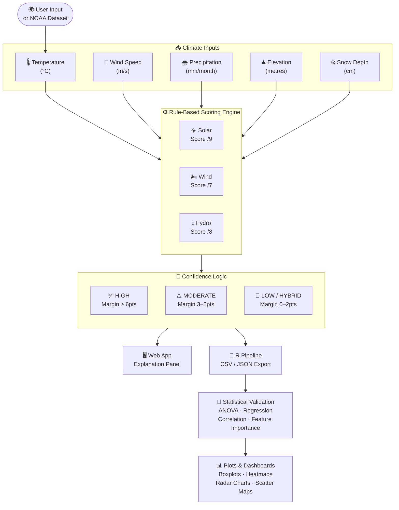
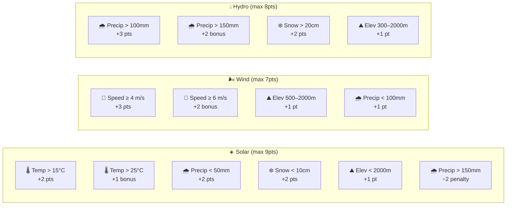
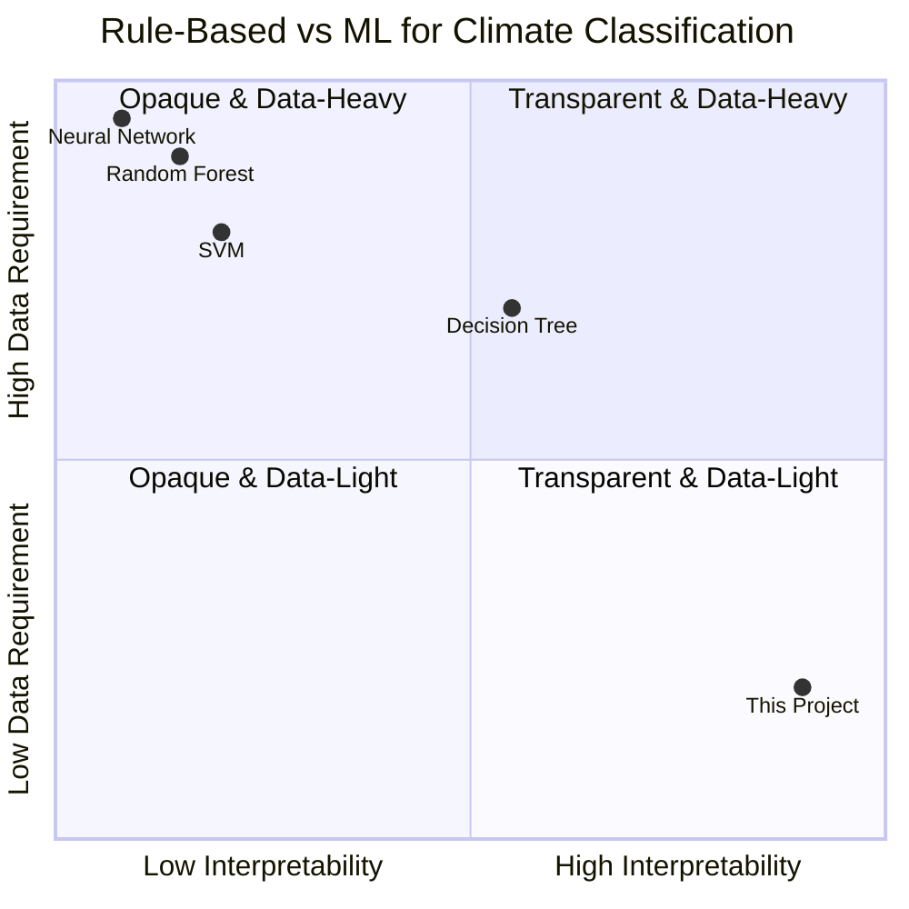
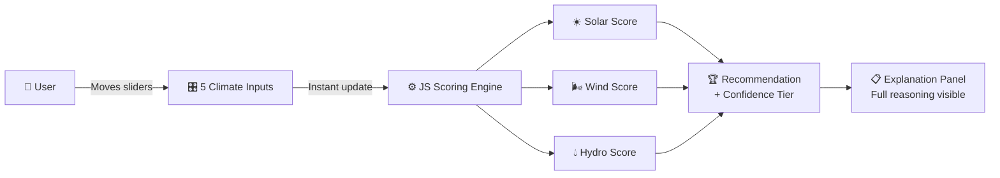
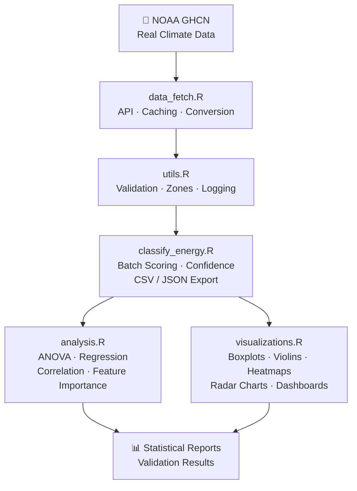
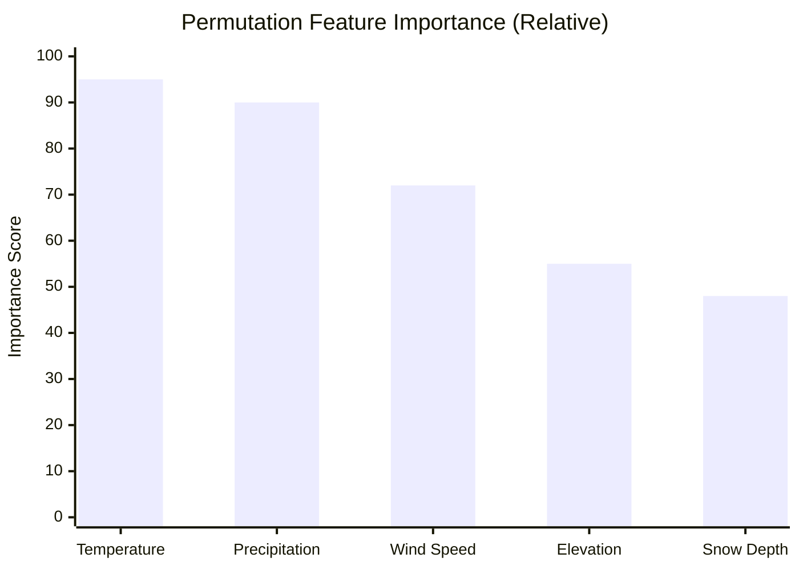
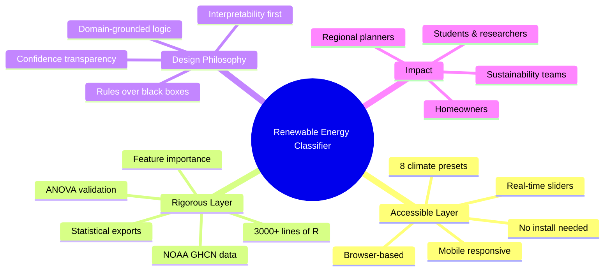

# 🌱 Renewable Energy Classifier

<div align="center">

[](https://weather-energy.netlify.app/)
[](https://github.com/Sahibjeetpalsingh/Weather-Classification)
[](https://weather-energy.netlify.app/)
[](https://www.ncdc.noaa.gov/data-access/land-based-station-data/land-based-datasets/global-historical-climatology-network-ghcn)
[](LICENSE)

### *Solar, Wind, or Hydro — what does the climate of a place actually support?*

**A transparent, rule-based climate intelligence tool backed by real NOAA data and 3000+ lines of R analysis.**

[🚀 Try the Live App](https://weather-energy.netlify.app/) · [📊 View the R Code](https://github.com/Sahibjeetpalsingh/Weather-Classification) · [👤 Connect on LinkedIn](https://linkedin.com/in/sahibjeet-pal-singh-418824333)

</div>

---

<p align="center">
  <a href="https://weather-energy.netlify.app/">
    
  </a>
</p>

---

## 📖 The Story

The renewable energy conversation usually stops too early.

People say things like *"solar is good in sunny places"* or *"hydro works in the mountains"* — but those answers are too vague to support real decisions. A homeowner deciding whether rooftop solar is worth the cost, a student building a sustainability case study, or a planner comparing options for a region needs something more precise:

> **Given the climate of this exact place, which renewable energy source is most viable — and why?**

That is the gap this project was built to close.

Renewable Energy Classifier is a **transparent decision tool** that takes five climate inputs, scores Solar, Wind, and Hydro independently, and returns a recommendation with a fully visible reasoning trail. Instead of hiding logic inside a black-box model, it shows the user exactly which conditions mattered, how many points they contributed, and how confident the recommendation really is.

---

## 🎬 Watch It Work

<p align="center">
  <a href="https://weather-energy.netlify.app/">
    
  </a>
</p>

<p align="center">
  <em>Move the climate sliders → scores update in real time → recommendation appears with full reasoning trail.</em>
</p>

---

## 🖼️ Visual Tour

| Interface | Preview |
|:---|:---:|
| 🎛️ Climate presets and slider controls |  |
| 📊 Transparent score breakdown panel |  |
| 📈 Analysis dashboard and R charts |  |

---

## 🏗️ System Architecture

How a climate input travels from the user all the way to a validated recommendation:



---

## 🔬 What The Tool Actually Does

The app evaluates a location using **five climate signals**:

```
┌──────────────────┬──────────────────────────────────────────┐
│  Climate Signal  │  Role in Scoring                         │
├──────────────────┼──────────────────────────────────────────┤
│  🌡️ Temperature  │  Primary solar viability signal           │
│  💨 Wind Speed   │  Core wind energy threshold driver        │
│  🌧️ Precipitation│  Drives hydro; penalises solar            │
│  ⛰️ Elevation    │  Boosts wind; gates hydro head            │
│  ❄️ Snow Depth   │  Snowpack bonus for hydro; solar penalty  │
└──────────────────┴──────────────────────────────────────────┘
```

Each energy type is scored against explicit thresholds from domain research:

| Energy Type | ✅ Signals That Help | ❌ Signals That Hurt | 💡 Core Logic |
|:---|:---|:---|:---|
| ☀️ **Solar** | Warm temps, low precipitation, low snow, accessible elevation | Heavy rainfall, persistent cloud cover, deep snow | Best for warm, dry, clear-sky climates |
| 🌬️ **Wind** | Strong average wind, favorable elevation, lower moisture | Weak wind, poor terrain exposure | Best where airflow is consistently strong enough to be economically viable |
| 💧 **Hydro** | High precipitation, snowpack, useful elevation drop | Dry climates, flat lowland terrain | Best where water supply and gravitational head are both available |

---

## ⚙️ The Decision Engine

The scoring algorithm is intentionally transparent — every point is explainable.



### Confidence Tiers

| Score Gap (1st vs 2nd) | Confidence | Interpretation |
|:---:|:---:|:---|
| **≥ 6 pts** | 🟢 High | Clear winner — single source recommended |
| **3–5 pts** | 🟡 Moderate | Likely winner — secondary source worth noting |
| **0–2 pts** | 🔴 Low | Tied climate — hybrid approach worth considering |

---

## 🧪 Example Scenarios

| 🌍 Scenario | Inputs | 🏆 Recommendation | Why It Makes Sense |
|:---|:---|:---:|:---|
| 🏜️ **Desert** | `35°C · 4 m/s · 10 mm · 300 m · 0 cm` | ☀️ Solar | Hot, dry, cloud-light conditions maximize solar viability |
| 🏔️ **Mountain** | `5°C · 7 m/s · 120 mm · 2000 m · 30 cm` | 🌬️ Wind *(low conf.)* | Strong wind + elevation favor wind, but hydro stays competitive |
| 🌧️ **Monsoon** | `26°C · 5 m/s · 200 mm · 500 m · 0 cm` | 💧 Hydro | Heavy rainfall overwhelms solar and dominates hydro viability |
| 🌊 **Coastal** | `18°C · 8 m/s · 70 mm · 50 m · 0 cm` | 🌬️ Wind *(high conf.)* | Persistent coastal wind at accessible elevation — optimal wind site |
| 🌿 **Temperate** | `12°C · 3 m/s · 90 mm · 400 m · 5 cm` | 💧 Hydro *(moderate)* | Moderate precipitation with enough head; wind and solar both weak |

---

## 🆚 Why Rule-Based Instead of Machine Learning?

This was the design choice that shaped the entire project.



| Question | ✅ Rule-Based Scoring | ❌ Typical ML Classifier |
|:---|:---|:---|
| Is the logic visible? | Yes — every point is explainable | Usually no |
| Needs labeled training data? | No | Yes |
| Can users challenge the output? | Yes — inspect the exact rules | Rarely |
| Confidence easy to communicate? | Yes — derived from score margins | Harder without extra work |
| Better fit for this problem? | ✅ Yes — domain knowledge is strong, labels are scarce | Not ideal |

> **For this use case, interpretability is not a nice-to-have. It is the product.**

---

## 🌐 The Web App

Built with plain HTML, CSS, and JavaScript — deployed on Netlify. No framework, no backend, no install step.



**Front-End Highlights:**

- ⚡ Single static page — loads instantly, works offline
- 🎛️ Five climate sliders covering all major variables
- 🔄 Real-time score updates as you drag
- 🌍 Eight built-in climate presets for quick exploration
- 📊 Full score breakdown shown — not just the winner
- 📱 Responsive — desktop, tablet, and mobile

---

## 📐 The R Analysis Suite

The web app is the *accessible layer*. The R code is the *rigor layer*.



| Module | Role | Key Capabilities |
|:---|:---|:---|
| `classify_energy.R` | Core classification engine | Batch scoring, confidence logic, summaries, CSV/JSON export |
| `analysis.R` | Statistical validation | ANOVA, correlation, regression, confusion metrics, feature importance |
| `visualizations.R` | Presentation-quality charts | Boxplots, violins, heatmaps, scatter maps, radar charts, dashboards |
| `data_fetch.R` | NOAA API integration | Pagination, caching, unit conversion, retry logic, regional fetches |
| `utils.R` | Shared infrastructure | Validation, conversions, climate zones, daylight, logging, helpers |

---

## 📊 What The Analysis Found

The validation work matters because this project is not just making intuitive guesses.



**Key findings from the R validation pipeline:**

- 📌 **ANOVA** showed strong separation between climate profiles of Solar, Wind, and Hydro recommendations
- 🌡️ **Temperature and precipitation** emerged as the strongest class separators overall
- 💨 **Wind speed** behaved more independently — wind recommendations appear across a wider mix of climates
- 🏆 **Permutation feature importance** ranked: `Temperature > Precipitation > Wind Speed > Elevation > Snow Depth`
- ✅ Recommendations were **statistically distinct** and easy for users to interpret and defend

> **The tool is both explainable and empirically grounded.** That combination is the real achievement.

---

## 🗂️ Project Structure

```text
Weather-Classification/
├── index.html               ← Single-page web app
├── classify_energy.R        ← Core R classification engine
├── analysis.R               ← Statistical validation suite
├── visualizations.R         ← Chart and dashboard generation
├── data_fetch.R             ← NOAA API integration
├── utils.R                  ← Shared helpers and utilities
├── data.csv                 ← Sample / exported dataset
├── README.md
└── docs/
    ├── images/              ← Screenshots, GIFs, hero image
    └── videos/              ← Optional walkthrough videos
```

---

## 🚀 Run It

### Web App

```bash
# Option 1: Visit the live deployment
open https://weather-energy.netlify.app/

# Option 2: Run locally — no build step required
open index.html
```

### R Analysis Pipeline

```r
# Install dependencies
install.packages(c("jsonlite", "ggplot2", "tidyr", "dplyr", "readr", "purrr"))

# Run the full pipeline
source("classify_energy.R")   # Core scoring engine
source("analysis.R")          # Statistical validation
source("visualizations.R")    # Generate all charts
```

### Fetch Real NOAA Data

```r
# Add your NOAA CDO API token to data_fetch.R, then:
source("data_fetch.R")
fetch_region_data(bbox = c(lat_min, lon_min, lat_max, lon_max))
```

> Get a free NOAA CDO API token at [ncdc.noaa.gov](https://www.ncdc.noaa.gov/cdo-web/token)

---

## 💡 Why This Project Matters

This project makes two arguments simultaneously:

**1. It's a practical tool** — fast, accessible, and understandable renewable energy recommendations for any climate profile.

**2. It's a methodological argument** — when scientific rules are well understood and labeled data is weak or unavailable, a transparent rule-based system can be *more trustworthy* than a more fashionable ML model.



---

## 👤 Author

<div align="center">

**Sahibjeet Pal Singh**
*Data Science · Simon Fraser University*

[](https://github.com/Sahibjeetpalsingh)
[](https://weather-energy.netlify.app/)
[](https://linkedin.com/in/sahibjeet-pal-singh-418824333)

</div>

---

<div align="center">

*Built with ☀️ 🌬️ 💧 and a lot of R.*

</div>
