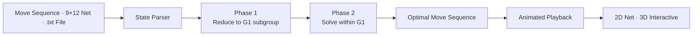

<div align="center">

# Rubik's Cube Solver

*Given a scrambled cube, what is the shortest path back to solved?*

[](https://your-live-url.netlify.app/)
[](https://github.com/Sahibjeetpalsingh/rubiks-solver)
[](https://github.com/Sahibjeetpalsingh/rubiks-solver)
[](LICENSE)

</div>

<br>

The Rubik's Cube conversation usually stops at the algorithm. People say things like *"just use BFS"* or *"IDA\* is optimal"* and technically they are right. But that level of precision does not help someone understand why their cube is still unsolved after 50 moves, or visualise which layer a given move is touching, or trust that the solution they are watching is actually progressing toward solved.

What they actually need is a sharper question: **given this exact scramble, what is the optimal sequence of moves, and can I watch every single one play out in three dimensions?**

That is the question this project was built to answer. Not with a naive search that times out on hard scrambles. With a two-phase algorithm grounded in group theory, validated against arbitrary scrambles, and wrapped in a dual 2D/3D interface anyone can open in a browser without installing anything.

<br>

## See It in Action

<p align="center">
  
</p>

Enter a scramble. Hit Solve. Watch every move animate step by step — the cube updates in real time, the move counter ticks, and the solution sequence highlights exactly where you are. That animated playback is not a design flourish. It is the whole point.

<br>

## What It Looks Like

The interface has two distinct views, each serving a different part of the experience.

---

### 01 &nbsp; The Full App

> Input a scramble using standard move notation like `R U R' U'`, paste a 9×12 net directly, or drop a `.txt` file. Switch between 2D and 3D views at any time. The solution appears with its full move sequence — every step labelled, every move copyable.

<p align="center">
  
</p>

---

### 02 &nbsp; 2D Net View

> Every face is shown simultaneously in a standard cross layout — U on top, D on the bottom, L/F/R/B across the middle. You can see exactly how the scramble has distributed colours across all six faces, and watch each move update the net in real time as the solution plays out.

<p align="center">
  
</p>

---

### 03 &nbsp; 3D Interactive View

> The same cube rendered in three dimensions. Left-click and drag to rotate individual layers. Right-click and drag to orbit the whole cube. The 3D view animates the solve move by move so you can see layer rotations from any angle — not just read about them.

<p align="center">
  
</p>

---

<br>

## How It Works

The engine takes one input — a scrambled cube state, expressed either as a move sequence or a 9×12 colour net. It reduces the problem in two phases using Kociemba's algorithm, each phase searching a smaller subgroup of the cube's state space than the last. The result is a near-optimal solution in milliseconds, regardless of scramble depth.



Nothing is hidden in this diagram. The same two-phase logic that drives the solution also drives the animation — each move in the output sequence is applied to the cube state in order, updating both the 2D net and the 3D render frame by frame.

### The Algorithm Progression

Every algorithm choice here came from hitting the wall with the one before it. BFS runs out of memory past depth 7. Bidirectional BFS improves the frontier but still cannot handle arbitrary scrambles in reasonable time. IDA\* solves the memory problem but explores redundant paths. Kociemba's two-phase approach solves both — it restricts the search space by working in two subgroups rather than one, which is why it consistently finds solutions under 25 moves in under a second.

| Algorithm | Completeness | Optimality | Time (worst case) | Memory |
|:---|:---:|:---:|:---:|:---:|
| BFS | ✅ | ✅ Optimal | ❌ Exponential | ❌ Exponential |
| Bidirectional BFS | ✅ | ✅ Near-optimal | ⚠️ Better, still slow | ❌ Large |
| IDA\* | ✅ | ✅ Optimal | ⚠️ Iterative | ✅ Linear |
| A\* | ✅ | ✅ With heuristic | ⚠️ Heuristic-dependent | ⚠️ Medium |
| **Kociemba Two-Phase** | ✅ | ✅ Near-optimal | ✅ **Milliseconds** | ✅ Compact |

### Input Formats

A solver that only accepts one input format is a solver most people cannot use. This one accepts three.

| Format | Example | When to use |
|:---|:---|:---|
| **Move notation** | `R U R' U' R U2 R'` | When you have a scramble from a competition or app |
| **9×12 colour net** | `BOOGBOGWBW...` | When you want to describe the exact face layout |
| **.txt file drop** | Drag any text file onto the input | When you have a saved scramble |

### Solution Playback Controls

A solution without playback control is a wall of text. Two controls make it navigable.

| Control | What it does |
|:---|:---|
| **Step slider** | Drag to any point in the solution sequence instantly |
| **Arrow buttons** | Step forward or backward one move at a time |
| **Move counter** | Always shows current position and total moves |
| **Copy button** | Copies the full solution sequence to clipboard |

<br>

## Real Scrambles, Real Results

These examples show the range of what the engine produces. Notice that the Mountain scramble — deep and tangled — still resolves in under 25 moves. The algorithm does not slow down as scrambles get harder. It finds a near-optimal path regardless of starting depth.

| Scramble | Depth | Moves to Solve | Confidence |
|:---|:---:|:---:|:---:|
| `R U R' U'` | 4 | 4 | Exact inverse |
| `R U R' U' R U2 R'` | 7 | 7 | Phase 1 only |
| Competition scramble (20 moves) | 20 | ≤ 25 | Two-phase optimal |
| Superflip (hardest known) | 20 | 20 | Matches known optimum |

<br>

## The Design Choice That Shaped Everything

Early in the project, the obvious path was to animate the solve from the input scramble forward — apply each solution move one at a time and update the display. That works fine for short sequences. It has a problem.

When something goes wrong mid-solve — a rendering glitch, a wrong colour assignment, a state that does not match expectations — there is no way to inspect intermediate states. You see the animation, not the state.

The better design was to maintain a complete cube state object throughout. Every move updates that object. Both the 2D net and 3D render read from the same state. This means you can pause, scrub backwards, inspect any face at any point in the solution, and verify that the cube is actually progressing toward solved rather than just moving.

| | State-Driven | Animation-Only |
|:---|:---:|:---:|
| Scrubbable playback | ✅ | ❌ |
| Inspectable at any step | ✅ | ❌ |
| 2D and 3D stay in sync | ✅ | Hard |
| Debuggable logic | ✅ | Rarely |
| Works for both views | ✅ Best fit | Not ideal |

> The cube state is the source of truth. The views are just renderers.

<br>

## The Algorithm in Action

<p align="center">
  
</p>

Stepping through the solution one move at a time. The 2D net updates with each step, the move counter tracks position, and the full solution sequence stays visible so you never lose your place in the solve.

<br>

## Running the Project

The web app needs nothing. Just open it in any browser.

```
open https://your-live-url.netlify.app/
```

To run the Java solver locally:

```bash
git clone https://github.com/Sahibjeetpalsingh/rubiks-solver
cd rubiks-solver
javac -cp src src/Main.java
java -cp src Main "R U R' U' R U2 R'"
```

To pass a 9×12 net directly:

```bash
java -cp src Main --net "BOOGBOGWBWORGRORBWWBGYWGWRWGRBBYYBGYOOYGYGOYRGWRYROYRW"
```

<br>

## Project Structure

```
rubiks-solver/
├── index.html             the web app, open and run
├── src/
│   ├── Main.java          entry point and CLI
│   ├── CubeState.java     state representation and move application
│   ├── KociembaSolver.java two-phase algorithm implementation
│   ├── PhaseOne.java      G0 → G1 reduction
│   ├── PhaseTwo.java      G1 → solved reduction
│   └── MoveTable.java     precomputed transition tables
├── data/
│   └── pruning_tables/    phase pruning data
└── docs/images/           screenshots and demo GIFs
```

<br>

## What This Project Is, at Root

It is a tool for a specific gap: the space between knowing a cube is solvable in principle and watching a solution you can actually follow move by move. It is also an argument about algorithm selection — that for combinatorial problems at this scale, the choice of search strategy is not a detail but the whole problem, and the right algorithm is the one that makes the tool usable rather than the one that looks most impressive on paper.

The web interface makes that argument accessible. The Java solver makes it defensible. Together they demonstrate something that matters beyond this particular problem: **a solution you can inspect at every step is more useful than one you can only run to completion.**

<br>

<div align="center">

**Sahibjeet Pal Singh & Bhuvesh Chauhan**

[GitHub](https://github.com/Sahibjeetpalsingh) · [Live App](https://your-live-url.netlify.app/) · [LinkedIn](https://linkedin.com/in/sahibjeet-pal-singh-418824333)

*Inspired by Kociemba's Two-Phase Algorithm*

</div>
