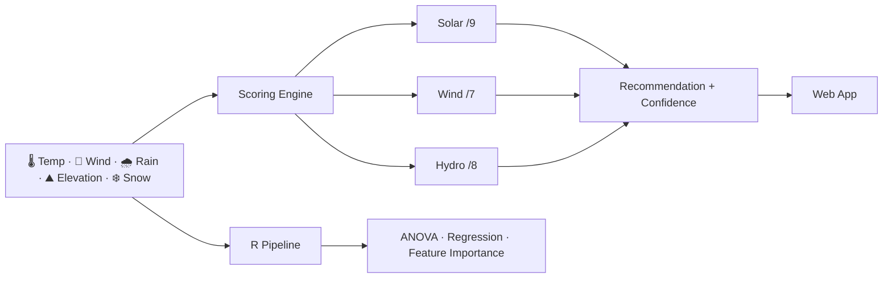
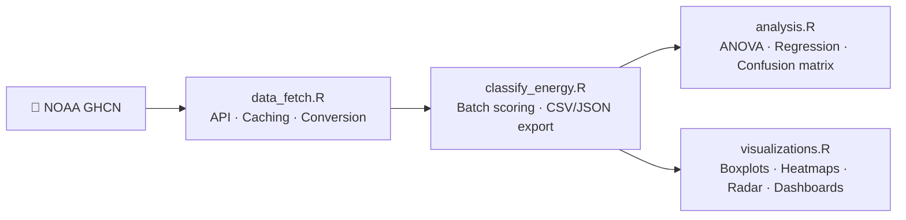

<div align="center">


# Renewable Energy Classifier

*Given the climate of a place — which renewable energy source does it actually support?*

[](https://weather-energy.netlify.app/)
[](https://github.com/Sahibjeetpalsingh/Weather-Classification)
[](https://www.ncdc.noaa.gov/data-access/land-based-station-data/land-based-datasets/global-historical-climatology-network-ghcn)
[](LICENSE)

</div>

---

A browser-based tool that scores **Solar**, **Wind**, and **Hydro** viability from five climate inputs, returns a recommendation with a visible reasoning trail, and backs every decision with a 3000+ line R analysis pipeline on real NOAA data.

No black box. No training data needed. Every point is explainable.

---

## Demo

<p align="center">
  <a href="https://weather-energy.netlify.app/">
    
  </a>
</p>

---

## Screenshots

| Sliders & Presets | Score Breakdown | R Analysis Dashboard |
|:---:|:---:|:---:|
|  |  |  |

---

## How It Works

Five climate inputs enter the scoring engine. Each energy type is evaluated independently against physics-grounded thresholds. The highest scorer wins — and the margin determines confidence.



### Scoring Thresholds

| | ☀️ Solar | 🌬️ Wind | 💧 Hydro |
|:---|:---|:---|:---|
| **Max score** | 9 | 7 | 8 |
| **Key triggers** | Temp > 15°C, Precip < 50mm, Snow < 10cm | Speed ≥ 4 m/s, Elev 500–2000m | Precip > 100mm, Snow > 20cm, Elev 300–2000m |
| **Penalties** | Precip > 150mm (−2) | Weak wind, flat terrain | Dry climate, no elevation |
| **Best climate** | Warm, dry, clear-sky | Exposed ridgelines, coasts | High-rainfall, mountain catchments |

### Confidence Tiers

| Margin (1st vs 2nd) | Confidence | Action |
|:---:|:---:|:---|
| ≥ 6 pts | 🟢 High | Single source recommended |
| 3–5 pts | 🟡 Moderate | Primary source with secondary noted |
| 0–2 pts | 🔴 Low | Hybrid approach worth considering |

---

## Example Presets

| Climate | Temp | Wind | Precip | Elev | Snow | Result |
|:---|:---:|:---:|:---:|:---:|:---:|:---:|
| 🏜️ Desert | 35°C | 4 m/s | 10 mm | 300 m | 0 cm | ☀️ Solar — High |
| 🏔️ Mountain | 5°C | 7 m/s | 120 mm | 2000 m | 30 cm | 🌬️ Wind — Low |
| 🌧️ Monsoon | 26°C | 5 m/s | 200 mm | 500 m | 0 cm | 💧 Hydro — High |
| 🌊 Coastal | 18°C | 8 m/s | 70 mm | 50 m | 0 cm | 🌬️ Wind — High |
| 🌿 Temperate | 12°C | 3 m/s | 90 mm | 400 m | 5 cm | 💧 Hydro — Mod |

---

## Why Rule-Based, Not ML?

| | Rule-Based | ML Classifier |
|:---|:---:|:---:|
| Logic is visible | ✅ | ❌ |
| Needs labeled training data | ❌ | ✅ |
| Users can challenge the output | ✅ | Rarely |
| Confidence is easy to communicate | ✅ | Extra work |
| Works where domain knowledge is strong | ✅ Best fit | Not ideal |

When the rules are well understood and labeled data is scarce, **interpretability is not a feature — it is the product.**

---

## R Analysis Pipeline



| Module | Purpose |
|:---|:---|
| `classify_energy.R` | Batch scoring, confidence logic, export |
| `analysis.R` | ANOVA, correlation, regression, feature importance |
| `visualizations.R` | Boxplots, violins, heatmaps, scatter maps, radar charts |
| `data_fetch.R` | NOAA API pagination, caching, unit conversion |
| `utils.R` | Validation, climate zones, daylight helpers, logging |

### What the Analysis Found

- ANOVA confirmed strong separation between the climate profiles of Solar, Wind, and Hydro classes
- **Temperature and precipitation** were the strongest separators; wind speed behaved more independently
- Permutation feature importance order: `Temperature > Precipitation > Wind Speed > Elevation > Snow Depth`
- Recommendations are statistically distinct *and* immediately interpretable — both at once

---

## Run It

**Web app** — no install, no build step:
```
open https://weather-energy.netlify.app/
# or just open index.html locally
```

**R pipeline:**
```r
install.packages(c("jsonlite", "ggplot2", "tidyr", "dplyr", "readr", "purrr"))

source("classify_energy.R")
source("analysis.R")
source("visualizations.R")
```

**Fetch NOAA data** — add your free CDO token to `data_fetch.R`, then:
```r
fetch_region_data(bbox = c(lat_min, lon_min, lat_max, lon_max))
```

---

## Project Structure

```
Weather-Classification/
├── index.html
├── classify_energy.R
├── analysis.R
├── visualizations.R
├── data_fetch.R
├── utils.R
├── data.csv
└── docs/images/
```

---

## The Point

Most energy tools are either too expensive, too academic, or too opaque. This one is none of those.

A transparent rule-based engine means every recommendation can be read, challenged, and understood — by a homeowner, a student, or a regional planner. The R pipeline means those rules are validated against real climate data, not intuition.

**Explainable and empirically grounded. Both at once.**

---

<div align="center">

**Sahibjeet Pal Singh**

[GitHub](https://github.com/Sahibjeetpalsingh) · [Live App](https://weather-energy.netlify.app/) · [LinkedIn](https://linkedin.com/in/sahibjeet-pal-singh-418824333)

</div>
