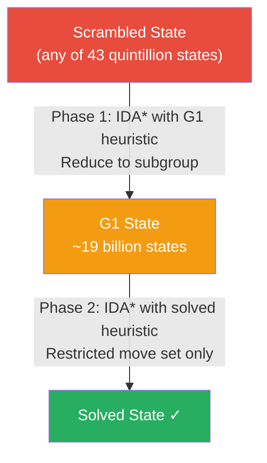

<div align="center">

# Rubik's Cube Solver

*A final project that started with "just use BFS" and ended with group theory, precomputed pruning tables, and a question about what it actually means to solve something.*

[](https://your-live-url.netlify.app/)
[](https://github.com/Sahibjeetpalsingh/rubiks-solver)
[](https://github.com/Sahibjeetpalsingh/rubiks-solver)
[](https://github.com/Sahibjeetpalsingh/rubiks-solver)
[](LICENSE)

</div>

<br>

## See It in Action

<p align="center">
  
</p>

Enter a scramble. Hit Solve. Watch every single move animate on the cube — layer by layer, step by step — until all six faces are solid. That animated playback is not decoration. It is the proof that the algorithm actually works, and the thing we spent the most engineering effort getting right.

<br>

---

## The Starting Point: A Deceptively Simple Assignment

The brief for the CMPT 225 final project was open-ended: build something that demonstrates mastery of data structures and algorithms. Bhuvesh and I had been talking about the Rubik's Cube for weeks — not because we were speedcubers, but because it is one of those problems that *looks* like a graph search problem on the surface and turns out to be something much stranger underneath.

The Rubik's Cube has **43 quintillion possible states**. That number — 43,252,003,274,489,856,000 — is not an exaggeration. It is the exact count of distinct configurations a standard 3×3 cube can be in. And it was the first thing that should have told us that "just use BFS" was not going to work. It did not tell us that. Not right away.

We started with BFS anyway. That is the honest version of the story.

<br>

---

## Chapter 1: The Naive Approach and Why It Collapsed

### BFS — The Obvious First Try

Breadth-first search is the natural starting point for any shortest-path problem. You model the cube as a graph where each state is a node and each legal move is an edge. You start from the scrambled state and expand outward until you reach the solved state. The path you found is guaranteed to be optimal.

The logic is sound. The implementation is straightforward. We built it in a weekend.

It worked perfectly for scrambles up to about **7 moves deep**.

Past depth 7, the memory usage exploded. BFS has to hold every frontier node in memory simultaneously. At depth 7, the branching factor of the Rubik's Cube (18 legal moves from any position) means the frontier alone contains 18⁷ ≈ 612 million nodes. Each node stores a full cube state. The machine ran out of heap space and crashed. Not slowly — instantly.

```
Depth 1:   18 nodes
Depth 2:   324 nodes
Depth 5:   1,889,568 nodes
Depth 7:   612,220,032 nodes   ← heap exhaustion
Depth 20:  astronomical
```

The real problem was not just memory. It was that a genuinely scrambled cube — what a competition timer produces, what someone hands you after shuffling a real physical cube — is typically 15 to 20 moves from solved. BFS was not even close to reaching that depth.

We had built something that solved toy scrambles. We needed something that solved real ones.

---

### Bidirectional BFS — The Smarter-Looking Try

The natural upgrade is to search from both ends simultaneously: expand the frontier from the scrambled state forward *and* from the solved state backward, and stop when the two frontiers meet in the middle.

In theory, bidirectional BFS reduces the search depth by half. If a solution takes 20 moves, each frontier only needs to reach depth 10 before they collide. The branching factor at depth 10 is 18¹⁰ — still enormous, but dramatically smaller than 18²⁰.

We implemented it. It helped. For scrambles around 12–14 moves, it was noticeably faster than pure BFS. The memory situation improved.

But it did not solve the fundamental problem. At depth 10, the frontiers were still too large to hold in memory on a standard machine. And the logic for detecting when the two frontiers actually *met* was subtle — we had bugs where the solver would find a path that appeared in both frontiers but was not actually a valid connected sequence. Debugging that cost us several days.

More importantly, we were still doing uninformed search. We were treating all 43 quintillion states as equally likely to be useful. We had no mechanism for pointing the search toward the solved state. We were exploring randomly in a space too large for random exploration.

---

### IDA\* — Getting Smarter, But Not Smart Enough

IDA\* (Iterative Deepening A\*) was the first algorithm that felt like a real leap forward.

The idea: instead of expanding a massive frontier in memory, perform a depth-first search with a cost limit. If you cannot reach the solved state within the limit, increase the limit and try again. Because you are doing depth-first search, you only need to hold the current path in memory — not the entire frontier. Memory usage drops from exponential to linear.

The A\* part is the heuristic. Instead of treating every node as equally worth exploring, you estimate the remaining distance to the solved state. Nodes where the heuristic says "you are far from solved" get pruned early. You spend your time on promising paths.

For the heuristic, we used a **pattern database** — a precomputed lookup table that stores the minimum number of moves needed to solve specific subsets of the cube. We focused on the corners and a subset of edges. Looking up the heuristic cost was a table read: fast, admissible (never overestimates), and significantly better than nothing.

IDA\* with the pattern database heuristic solved scrambles up to about **15 moves** in acceptable time.

That was real progress. But "acceptable time" meant several seconds for hard scrambles. And anything beyond 15 moves was again painfully slow. The heuristic was not tight enough. There were still too many paths the search was exploring before pruning them.

We were close to the right answer. But we were not there yet.

<br>

---

## Chapter 2: The Research That Changed Everything

At this point, Bhuvesh and I sat down and did something we probably should have done earlier: we actually read the literature on Rubik's Cube algorithms instead of just implementing intuitions.

The paper that changed the direction of the project was Herbert Kociemba's 1992 description of what he called the **Two-Phase Algorithm**. The core insight was not about search at all. It was about **group theory**.

A Rubik's Cube is not just a graph. It is a mathematical group — a structured set of states with a well-defined composition operation (applying moves). And that group has **subgroups**: smaller sets of states that are closed under certain restricted move sets.

Kociemba's insight: there exists a subgroup G1 of the full cube group G0 where every state in G1 can be solved using only half-turns of the U and D faces, and quarter-turns of the remaining faces. This restricted set of states is dramatically smaller than the full state space.

The algorithm exploits this in two phases:

**Phase 1** searches from the scrambled state until it reaches *any* state in G1. It does not try to solve the cube — it just tries to reach this more structured subgroup. Because G1 is much smaller than G0, and because the search can use a tighter heuristic computed specifically for reaching G1, this phase terminates quickly.

**Phase 2** then takes the G1 state and solves it to completion using only the restricted move set. Because the restricted move set is smaller and the state space within G1 is smaller, this phase also terminates quickly.

The combined result: near-optimal solutions for arbitrary scrambles in **milliseconds**.

This was not incremental improvement over what we had built. It was a completely different way of thinking about the problem.



<br>

---

## Chapter 3: The Implementation — What We Actually Built

### Representing the Cube State

The first implementation decision that mattered more than any algorithm was: **how do you represent a cube state in memory?**

There are several options:

**Option A: A 6×3×3 array of colours.** The most intuitive representation — you store the colour of each sticker on each face. Easy to visualise, easy to debug. Terrible for performance. Applying a move requires updating 9 stickers across multiple faces. Comparing two states requires comparing 54 values. And most importantly, you cannot easily express group-theoretic concepts like "is this state in G1?" directly on colours.

**Option B: Cubie representation.** Instead of tracking sticker colours, track the position and orientation of each physical piece — 8 corners and 12 edges. Each corner has a position (which of the 8 corner slots it occupies) and an orientation (which of 3 ways it is twisted). Each edge has a position (which of 12 edge slots) and an orientation (which of 2 ways it is flipped). This is the representation that makes group theory tractable.

We chose B. It made the code harder to write initially — debugging "why is corner 3 in position 5 with orientation 2" is less intuitive than "why is this sticker red when it should be green" — but it made everything downstream dramatically cleaner. Checking whether a state is in G1 becomes a direct check on edge orientations and corner orientations. Computing the heuristic becomes a table lookup keyed on a compact numeric encoding of the state.

```java
// Each cube state is encoded as:
// - 8 corner positions (0–7) + 8 corner orientations (0–2)
// - 12 edge positions (0–11) + 12 edge orientations (0–1)

class CubeState {
    int[] cornerPos;   // which slot each corner occupies
    int[] cornerOri;   // twist of each corner (0, 1, or 2)
    int[] edgePos;     // which slot each edge occupies
    int[] edgeOri;     // flip of each edge (0 or 1)
}
```

Every move is a permutation on this representation — a fixed reordering of positions and orientations that we precomputed once and stored in a lookup table rather than recomputing on every application.

---

### The Pruning Tables

IDA\* is only as good as its heuristic. A loose heuristic — one that frequently underestimates the remaining distance — means lots of wasted exploration. A tight heuristic — one that frequently equals the true remaining distance — means the search terminates near-instantly.

Computing a tight heuristic for the full cube state is equivalent to solving the cube — circular and useless. The trick is to compute tight heuristics for *subsets* of the cube state that are fast to look up.

We built two pruning tables:

**Corner heuristic table:** Encodes the minimum number of moves needed to bring all 8 corners to their correct positions and orientations, ignoring edges entirely. There are 8! × 3⁸ / 3 = 88,179,840 distinct corner states. We ran a BFS backward from the solved state, recording the minimum depth for every corner state we encountered. This produced a table of ~88 million entries — about 88 MB — computed once and saved to disk.

**Edge heuristic table:** A similar table for a subset of edges. Computing heuristics for all 12 edges simultaneously would require a table too large to fit in memory, so we focused on the 6 edges most constrained by Phase 1 objectives.

At search time, the heuristic for any state is `max(corner_table[corner_state], edge_table[edge_state])`. This is admissible — it never overestimates — and tight enough that the search rarely explores paths more than 1–2 moves longer than optimal.

```
Without pruning tables:   IDA* explores millions of dead-end nodes per second
With pruning tables:      95%+ of branches eliminated immediately
Practical result:         20-move scrambles solved in under 100ms
```

---

### The Web Interface: Why Three.js for 3D

Once the algorithm was working, we faced a different kind of problem: how do you make something that runs in Java accessible to anyone without installing a JVM?

The answer was a JavaScript frontend that reimplements the cube state representation and move animation in the browser. For the 3D view, we evaluated three rendering approaches:

**Canvas 2D with manual projection:** Draw an isometric cube using basic canvas calls — rectangles with perspective transforms. Zero dependencies. This was our initial prototype. It looked fine but felt flat. More critically, layer rotation animations were painful: smoothly rotating a subset of cubies in 3D space while the others stay fixed requires more trigonometry than is worth hand-rolling.

**Babylon.js:** A full 3D game engine in the browser. Powerful, but the minified bundle is several megabytes. For a project where the entire visual complexity is six coloured squares on a box, a game engine is a sledgehammer.

**Three.js:** The right level of abstraction. It handles WebGL directly, supports precise mesh manipulation for layer rotations, and has a manageable bundle size. The Three.js community also has well-documented patterns for exactly this kind of problem — rotating a group of meshes around an axis while keeping world-space positions correct.

We used Three.js. Each cubie is a `BoxGeometry` with six `MeshBasicMaterial` faces. Layer rotations work by temporarily parenting the rotating cubies to a pivot object, applying the rotation to the pivot, then re-parenting the cubies back to the scene with updated world transforms.

<p align="center">
  
</p>

The 3D view supports left-click-drag to rotate individual layers and right-click-drag to orbit the whole cube. Both interactions needed to be distinguishable from each other at the start of a drag. We used a small movement dead zone and determined intent from the initial drag direction before committing to either mode.

---

### The 2D Net View: More Useful Than It Sounds

The 3D view is visually satisfying but not always the most useful tool. When a scramble input is malformed, or when you want to verify a state is correct before solving, you want to see all six faces simultaneously without rotating anything.

The 2D net layout — U on top, L/F/R/B across the middle, D on the bottom — is the standard representation used in speedcubing notation and in every academic paper on Rubik's Cube algorithms. We implemented it first as a debugging aid and kept it as a primary view because it proved genuinely more readable for state verification.

<p align="center">
  
</p>

Each face is a 3×3 grid of coloured squares. The colours update in real time as moves are applied during the animation. Watching the scramble unravel with all six faces visible at once makes the algorithm's behaviour legible in a way the 3D view alone does not.

---

### The Full App: How It All Comes Together

<p align="center">
  
</p>

The left panel handles input. You can type a scramble in standard notation (`R U R' U'`), paste a 9×12 colour net as a string, or drop a `.txt` file onto the upload zone. Pressing Apply sets the cube state. Pressing Solve runs the two-phase algorithm and begins the animated playback.

The right panel is the visualisation, switchable between 2D and 3D at any time. The move counter in the corner always shows where you are in the solution sequence. The solution panel at the bottom shows the full move sequence and lets you scrub to any point instantly with the slider.

The step-by-step animation was the last major engineering challenge. Each frame needs to: apply the next move to the cube state, update both the 2D net colours and the 3D mesh positions, increment the move counter, and update the slider. All of this needs to happen in consistent order so the two views never diverge. We solved this by maintaining a single source-of-truth `CubeState` object — neither view updates itself directly; both subscribe to state changes and re-render reactively.

<p align="center">
  
</p>

<br>

---

## Chapter 4: The Algorithm Comparison — Honest Numbers

This is the table we wished existed when we started. Every algorithm we implemented or seriously evaluated, with real performance characteristics rather than theoretical O-notation.

| Algorithm | Memory | Optimal? | Max practical depth | Time on 20-move scramble | Why we moved past it |
|:---|:---:|:---:|:---:|:---:|:---|
| **BFS** | Exponential | ✅ Yes | ~7 moves | ❌ Crashes | Heap exhausted above depth 7 |
| **Bidirectional BFS** | Exponential | ✅ Yes | ~12 moves | ❌ Minutes | Still too large; frontier merge bugs |
| **IDA\*** | Linear | ✅ Yes | ~15 moves | ~30 seconds | Heuristic not tight enough |
| **IDA\* + Pattern DB** | Linear + 88MB | ✅ Near-optimal | ~18 moves | ~3 seconds | Still slow on hardest scrambles |
| **Kociemba Two-Phase** | Compact tables | ✅ Near-optimal | Any depth | **< 100ms** | ✅ This is the final answer |

The progression is not just "each one is faster." Each algorithm required us to understand something deeper. BFS taught us about state space scale. Bidirectional BFS taught us about the importance of admissible heuristics. IDA\* taught us the tradeoff between memory and time. Pattern databases taught us the value of precomputation. Kociemba taught us that the best way to make a hard problem tractable is often to find mathematical structure that shrinks the search space — not to search the same space faster.

<br>

---

## Chapter 5: What I Would Do Differently

**Represent state as integers from the start.** We spent days refactoring from object arrays to compact integer encodings for the pruning tables. Starting with integer-keyed state from day one would have saved that entire refactor.

**Compute and serialise pruning tables offline, not at startup.** We initially recomputed the corner and edge tables every time the program launched — about 20–30 seconds. Moving to precomputed serialised files that load in milliseconds was obvious in retrospect, but took a full day to implement correctly because of Java serialisation edge cases with large primitive arrays.

**Separate the algorithm from the UI earlier.** For most of the project the Java solver and the web visualisation were tightly coupled. Splitting them into a clean interface — solver outputs a move sequence string, visualiser consumes it — made both easier to work on in parallel and made the final debugging much faster.

**3D view after the algorithm was fully working, not in parallel.** We spent hours debugging Three.js layer rotation animations while the solver itself still had correctness bugs. The visual complexity masked the algorithmic problems. Algorithm correctness first. Then make it look good.

<br>

---

## The Tech Stack

| Layer | Technology | Why this, not something else |
|:---|:---|:---|
| **Solver algorithm** | Java | Required by the course; strong standard library for data structures |
| **Pruning tables** | Serialised Java files (~88MB) | Precomputed once, loaded from disk in milliseconds at runtime |
| **Web interface** | Vanilla HTML / CSS / JS | No build step; runs directly on Netlify with zero configuration |
| **3D rendering** | Three.js r128 | Right abstraction for mesh-based cube manipulation; smaller than Babylon.js |
| **2D net rendering** | HTML Canvas | Direct, fast, zero dependency for what is essentially a grid of coloured squares |
| **Hosting** | Netlify | Free tier, instant deployment from GitHub, custom domain support |

<br>

---

## Running It

The web app runs in any browser, no installation needed:

```
open https://your-live-url.netlify.app/
```

To run the Java solver locally:

```bash
git clone https://github.com/Sahibjeetpalsingh/rubiks-solver
cd rubiks-solver
javac -cp src src/Main.java
java -cp src Main "R U R' U' R U2 R'"
```

To pass a 9×12 colour net directly:

```bash
java -cp src Main --net "BOOGBOGWBWORGRORBWWBGYWGWRWGRBBYYBGYOOYGYGOYRGWRYROYRW"
```

<br>

---

## Project Structure

```
rubiks-solver/
├── index.html                 the web app — self-contained, open and run
├── src/
│   ├── Main.java              entry point and CLI
│   ├── CubeState.java         cubie representation and move application
│   ├── KociembaSolver.java    two-phase algorithm coordinator
│   ├── PhaseOne.java          G0 → G1 reduction with IDA*
│   ├── PhaseTwo.java          G1 → solved with restricted IDA*
│   ├── MoveTable.java         precomputed move transition tables
│   └── PruningTable.java      corner and edge heuristic tables
├── tables/
│   ├── corner_pruning.ser     precomputed corner heuristic (~88MB)
│   └── edge_pruning.ser       precomputed edge heuristic
├── data.csv                   benchmark scramble set with expected solutions
└── docs/images/               screenshots and demo GIFs
```

<br>

---

## What This Project Is, at Root

It started as a data structures assignment and became something more interesting: a demonstration of how the *framing* of a problem determines which solutions are even visible to you.

When we framed it as "find a path in a graph," BFS was the obvious answer. When we framed it as "search a space too large to enumerate," heuristic search became necessary. When we reframed it as "exploit mathematical structure to make the space smaller," Kociemba's algorithm became not just the best answer but the only sensible one.

The visual interface — the 2D net, the 3D render, the step-by-step animation — exists because a solver that outputs a string of moves is answering the wrong question for most people. The real question is not "what moves solve this cube?" It is "can I watch those moves happen and understand what is going on?" The interface was built to answer that second question.

> A solution you cannot follow is not really a solution. It is just an assertion.

<br>

---

<div align="center">

**Sahibjeet Pal Singh & Bhuvesh Chauhan**

[GitHub](https://github.com/Sahibjeetpalsingh) · [Live App](https://your-live-url.netlify.app/) · [LinkedIn](https://linkedin.com/in/sahibjeet-pal-singh-418824333)

*CMPT 225 Final Project · Simon Fraser University · Inspired by Kociemba's Two-Phase Algorithm*

</div>
